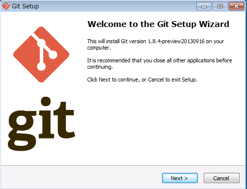

# TortoiseGitを使ったリポジトリ管理
TortoiseGitとはGitのGUIクライアントです。直感的で比較的簡単に扱うことができます。

## レッスン１．インストール
まずはTortoiseGitが利用できる環境を作るのに必要なソフトウェアを３つインストールします。
+ msysgit
+ TortoiseGit
+ TortoiseGit日本語言語パック
---
## msysgit
TortoiseGitをWindows環境で動作させるために必要なソフトです。
## TortoiseGit
公式サイトからダウンロードします。2018年5月18日時点での安定バージョンは2.6.0です。

32bit版と64bit版があるので、自分の環境に合わせてダウンロードして下さい。
## TortoiseGit日本語言語パック
上記のTortoiseGitと合わせて、言語パックもダウンロードして下さい。

こちらも32bit版と64bit版があるので、自分の環境に合わせてダウンロードして下さい。

***
# msygitのインストール

Windows版Gitである、msysgit のインストールは「Next」を押下すれば問題ありません。

いくつか選択肢が表示される場合がありますが、ここでは何も変更せずに「Next」を押下して下さい。

# TortoiseGitのインストール
GitのGUIクライアントである TortoiseGit のインストールを開始します。

いくつか選択肢が表示されますが「Next」をクリックすればインストールが完了します。

※インストールが完了したらGitの設定画面に進むように促されますが、言語パックをインストールした後にまとめて設定を行うので一旦無視して下さい。

## TortoiseGit日本語言語パックのインストール

インストーラーを実行するだけでインストールは完了です。

インストールは以上で完了です。

# セットアップ
TortoiseGitの日本語化設定を行います。

スタートメニュー＞TortoiseGit＞Setting を選択し、TortoiseGitの設定を行います。

Languageのプルダウンを選択し「English」から「日本語（日本）」に変更し、適応＞OKをクリックします。
***
## 名前とメールアドレスの設定
再度TortoiseGitのSettingをクリックすると、日本語化された設定画面がでてきます。

画面左側の「Git]を選択すると、初回は下記のようなダイアログが表示されますが、OKをクリックして進みます。

ユーザー情報部分にGithubに登録した際の名前（username）とメールアドレスを入力します。

OKをクリックし、一旦設定は完了です。

## クローン（複製）の作成
Gitの内容をデスクトップで編集できるように、クローンの作成を行います。

+ まずはデスクトップに新規フォルダを作成します。フォルダ名は任意ですが分かりやすいものが良いと思います。

+ 作成したフォルダの中で右クリックし、クローン（複製）をクリックします。

下記の画面が表示されるので、作成したいリポジトリのURLを入力します。

※GithubのURLコピー機能を利用すると便利です。

# ここに画像を入れる
URLを入力したらOKをクリックしましょう。自動的にクローンが作成されます。

成功と表示されたら、クローンの作成は完了です。

---
## キー（鍵）の設定
ファイルをプッシュする際（後述）に毎回ダイアログで、登録情報の入力を求められます。

プッシュの度に入力するのは面倒なので、キーの設定を行いましょう。

スタートメニューのTortoiseGitフォルダから、「Puttygen」を起動します。

※PuttygenはTortoiseGitをインストールした際に一緒にインストールされています。

起動すると上記の画面が表示されるので、「Generate」ボタンをクリックします。

